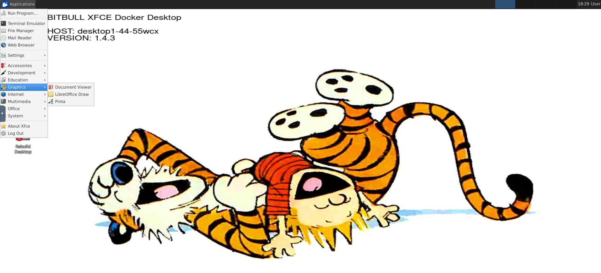

# docker.xfce-vnc
this is an xfce desktop which is intended to to be used for teaching env

## BUILD
```
vim VERSION
sh build.sh
```

## RUN
```
docker run --env VNC_PW=secure. --env DEBUG=true --publish 5901:5901 --publish 6901:6901 christian773/xfce-vnc:latest
```


## ScreenShot

